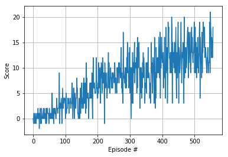

[//]: # (Image References)

[image1]: https://user-images.githubusercontent.com/10624937/42135619-d90f2f28-7d12-11e8-8823-82b970a54d7e.gif "Trained Agent"

# Project 1: Navigation with DQN Report

### Problem Statement/Environment Introduction:

![Trained Agent][image1]

##### Rewards:
- **Reward of +1 is provided for collecting a yellow banana**
- **Reward of -1 is provided for collecting a blue banana**

##### State Space
The state space has 37 dimensions and contains the agent's velocity, along with ray-based perception of objects around agent's forward direction.  Given this information, the agent has to learn how to best select actions.

##### Actions:
- **`0`** - move forward.
- **`1`** - move backward.
- **`2`** - turn left.
- **`3`** - turn right.

##### Succesful Completion Criteria
The task is episodic, and in order to solve the environment, your agent must get an average score of +13 over 100 consecutive episodes.

### Learning Algorithm 

##### Algorithm: DQN
DQN stands for Deep Q-Network. The main methodology of this algorithm is to represent Q-Value as a neural network. This is a two step algorithm:

**1.Sample Step**
In this step, given the current state we are in, we use the current estimate of the Q-Value and use epsilon greedy to choose an action. Then we interact with the environment and store/record the interaction (state, action, reward, next\_state, done) into the <em>replay buffer</em> for later learning use.

**2.Learn Step**
We sample a batch of experiences from the learning buffer and update our network with this loss function:
```
current_estimate = Q_local(state)[action]
target_estimate = max(Q_target(state))
loss = mse_loss(current_estimate,target_estimate)
```
Where Q\_target and Q\_local are both neural networks that represent the Q-value function. Q\_target is technically Q\_local from previous time step. This is done S.T we can have a more stable learning to prevent <em>moving target</em> problem and stabalize training. 
##### Hyperparameters

Model/Agent Parameters:
```bash
- BUFFER_SIZE = int(1e5)  # Replay buffer size
- BATCH_SIZE = 64         # Minibatch size
- GAMMA = 0.995           # discount factor
- TAU = 1e-3              # for soft update of target parameters
- LR = 5e-4               # learning rate 
- UPDATE_EVERY = 4        # how often to update the network
```

Runtime parameters:
```bash
- n_episodes = 2000  # Number of epsiodes we trained on
- max_tstep = 1000   # Max number of time step agent runs on during training
- eps_start=1.0      # Starting Epsilon (1.0 for full exploration to start)
- eps_end=0.01       # Minimum value of epsilon
- eps_decay=0.995    # Epsilon decay rate at every episode.
```
##### Neural Network Architecture
The main important factor of the neural network architecture is to have input as large as the state space.
and output layer as large as action space. Since the input is vector, we can use FC Networks. For this problem we use a simple 3-Layer FC with Relu activation to represent non-linearity.
Layer becomes:

1. FC-Layer(37, 64)
2. relu(64)
3. FC-Layer(64, 64)
4. relu(64)
5. FC-Layer(64, 4)

### Results
Here is the results of training and playing with the environment. the x-axis represent number of episodes, the y-axis represent score/rewards per episode.



### Future work
To further improve on our current implementation We can implement:
- Duelling DQN that help directly estimate value of state
- Prioritized Buffer that can allow us to more effectively learn from past experiences
- Double DQN to have two networks validate action before choosing the action


